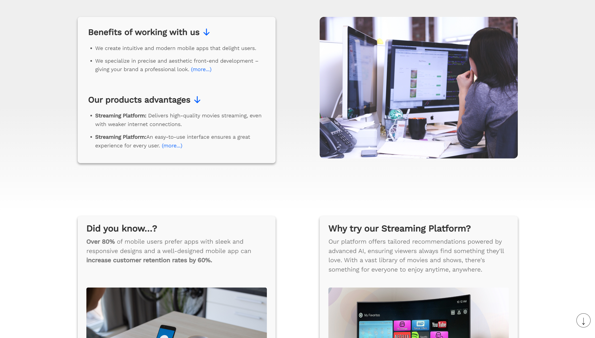

# GameHub

## Screenshots

    </img>
     
    </img>
     
    </img>
     
    </img>
     
    </img>

## Description

- A website for a (hypothetical) Software House company that offers its development services and showcases its products.
- There is a Products section presenting the company's product and a Docs section providing documentation for that product.
- StyledComponents was used for styling throughout the project.
- A mobile version has been created.

#### Technology used:

- JavaScript
- Typescript
- React
- Styled Components
- Created Utils and Model

## Author info

- **Name:** Filip Bereszyński
- **Contact:**
  - bereszynski.filip@gmail.com
  - (+48) 510 240 074
